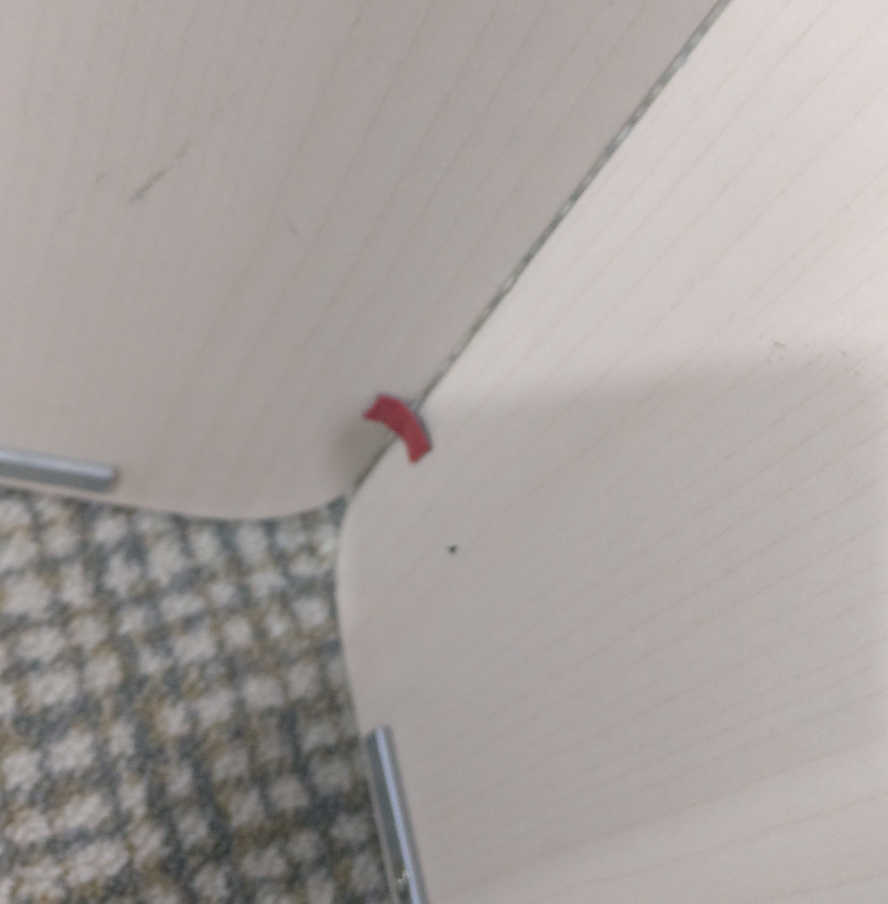
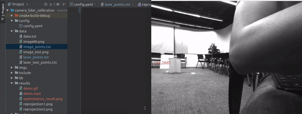
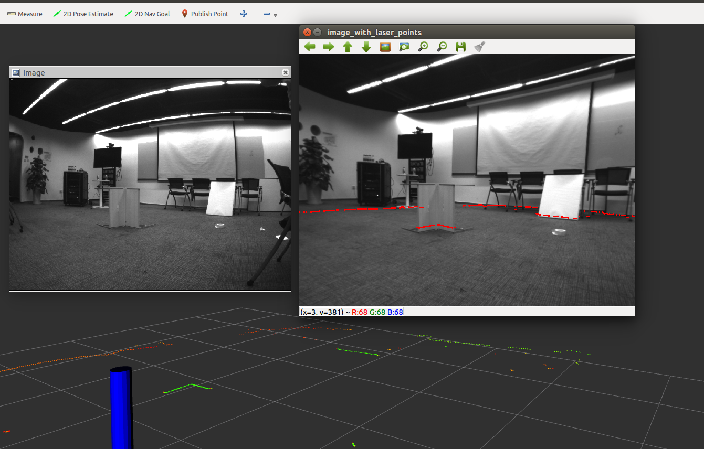

## Camera Lidar Calibration Tool.


Author:xinliangzhong(xinliangzhong@foxmail.com)


### 1.Description
The package is used to calibrate a 2D LiDAR or laser range finder (LRF)
with a monocular camera. Specficially, Hokuyo UTM-30LX have been suscessfully calibrated against a mono camera.

**But this approach is really a naive way, in a word, it just 3D-2D optimization problem.**
**So we decide to develop the new approach to calibrate the extrinsic** 

### 2.Prerequisites
We have tested the library in 16.04, but it should be easy to compile in other platforms.

##### OpenCV
We use [OpenCV](http://opencv.org) to manipulate images and features. Dowload and install instructions can be found at: http://opencv.org. **Required at leat 2.4.3. Tested with OpenCV 3.3**.

##### Eigen3
Download and install instructions can be found at: http://eigen.tuxfamily.org. **Required at least 3.1.0**.

##### Ceres
Download and install instructions can be found at: http://www.ceres-solver.org/installation.html.

### 3.How to build

```
mkdir -p ws/src
cd ws/src
catkin_init_workspace
cd ../
catkin_make --pkg camera_laser_calibration
```

### 4.How to Prepare the calibration data

#### Step1: Collect Laser and Camera data.

We need the 3d points in laser coordination and the same points in the image.
you can run:
```
roslaunch camera_laser_calibration collect_laser_image_data.launch
```
remember to change the path in **config.yaml** and ***.launch** files.
Open rqt and choose the **Plungs/Configuration/Dynamic Reconfiguration** and you will find the guide.
We combine the data in data_v2.txt with 4 cols which represents ``x y u v`` respectively.

#### Step2: Calibration

Modify the **calibration.launch** (data path), and run:
```
roslaunch camera_laser_calibration calibration.launch
```
The result will be saved in **camera_laser_calibration/data/calibration_result.txt**

#### Step3 Show the reprojection results
```
roslaunch camera_laser_calibration reprojection_test.launch
```

**So how to fine the 3D-2D pairs correctly?**
Here we provide a simple way:
Suppose your laser in the horizontal plane, and we just need to measure the height of the laser.
Actually the red point in the following picture is the flag that we tested in our setups.


For the ``x and y``, you can use the rviz (2D nav goal) tool to measure. The result will be show in the terminal.
For the ``u and v`` in the image, we provide a simple tool to detect corners in the rectangle your mouse selected.
and the data will automatically saved in ``data/image_points.txt``.


### 5.Key Algorithm

Actually it just a least square problem.


### 6.Show the reprojection results
``Tcl: which takes a vector from laser to camera.``



### 7.Good luck to you!