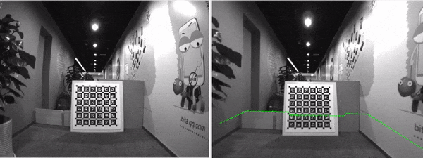
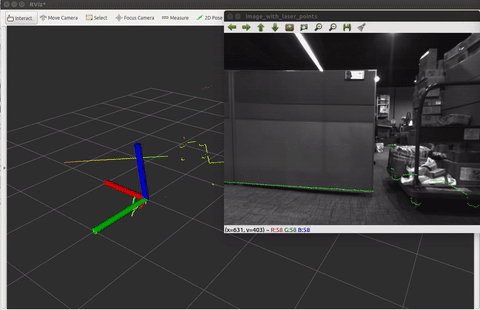
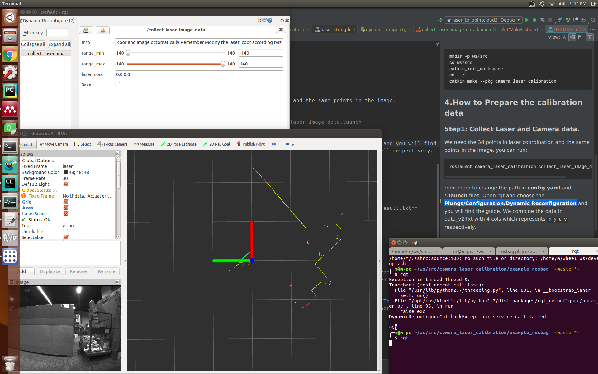
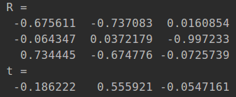

## Camera Lidar Calibration Tool ROS Version.


Author:xinliangzhong(xinliangzhong@foxmail.com)





#   怎么使用
##步骤0：
将解压包放到一个ros工作空间，并使用以下命令进行编译

```
catkin_make --pkg camera_laser_calibration
```

如果遇到cv_bridge的错误那请将Cmakelists.txt第12行取消注释
如果提示ceres未安装，请按照ceres官方指示进行安装操作

## 步骤1：
进入到ros工作空间

```
source devel/setup.bash
```

然后运行

```
roslaunch camera_laser_calibration collect_laser_image_data.launch
```
进入到你要用于标定的bag文件目录下 并执行
```
rosbag play --pause XXX.bag
```

此时记得用空格键来控制bag的播放与暂停

开启一个新的终端 启动rqt
选择**Plungs/Configuration/Dynamic Reconfiguration**

最终你在rviz和rqt将看到以下两个画面表示成功, 其中rviz出现图像和激光彩色线条，rqt中出现控制界面



## 步骤2

如果你不想看文字，可以直接看根目录下的演示视频 How_to_use.mp4

**暂停bag的播放**

通过rviz工具栏的 **2D Nav Goal** 去选择激光的点，选择之后会在第一个启动标定程序的终端显示出类似以下的内容


[ INFO] [1534164489.163120940]: Setting goal: Frame:laser, Position(**1.575, -0.752**, 0.000), Orientation(0.000, 0.000, -0.688, 0.725) = Angle: -1.518

请复制我标粗的部分到粘贴板
并切换到rqt界面，将其粘贴到laser_coor右边的框中，如果是上面的例子，粘贴完成应该显示1.575, -0.752

**勾选Save按钮**
此时会弹出当前激光对应的图像，你需要勾选一个小的矩形框，勾选完成后 会弹出检测出坐标点的特征点，然后对着图像窗口按键盘空格键，窗口将消失
数据将以 **x y u v** 的格式存自动保存在data/data_v2.txt文件夹下


## 步骤3
标定
将data/data_v2.txt 复制一份变为data.txt

```
roslaunch camera_laser_calibration calibration.launch
```

标定结果
``Tcl: 结果为激光雷达到相机的外参，它会自动保存到data文件夹下``



## 步骤4
重投影检验标定结果

```
roslaunch camera_laser_calibration reprojection_test.launch
```
会自动启动rviz，重投影图像是以rosmsg消息发布的

